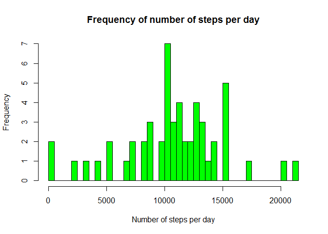
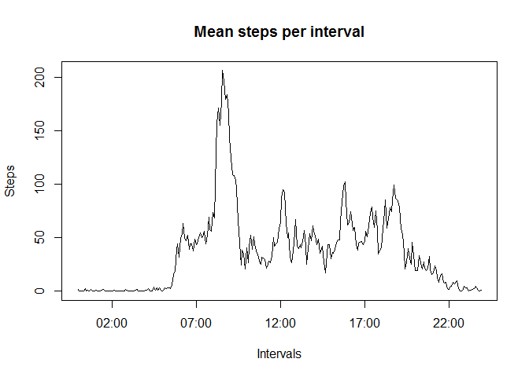
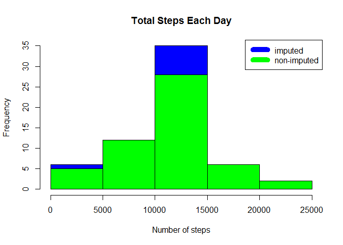
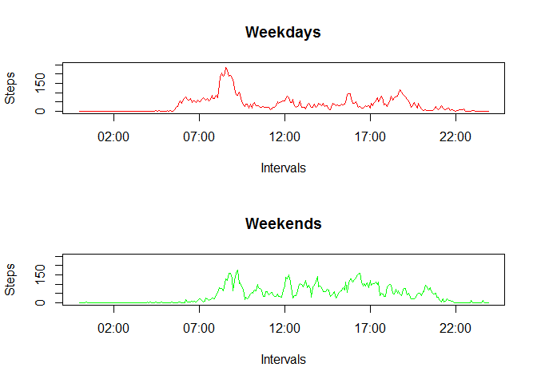

# Reproducible Research: Peer Assessment 1
Name: Li Lu (llu5@yahoo.com)
Date of submission: 02/21/2016


## Loading and preprocessing the data

```r
library(ggplot2)
library(dplyr)
```

```
## 
## Attaching package: 'dplyr'
```

```
## The following objects are masked from 'package:stats':
## 
##     filter, lag
```

```
## The following objects are masked from 'package:base':
## 
##     intersect, setdiff, setequal, union
```

```r
### create folder data and download file by using downloader package
if(!file.exists("./data")){dir.create("./data")}
fileUrl <- "https://d396qusza40orc.cloudfront.net/repdata%2Fdata%2Factivity.zip"

require(downloader)
```

```
## Loading required package: downloader
```

```r
download(fileUrl, "data/repdata_data_activity.zip", mode = "wb") 
```

### unzip the repdata_data_activity.zip file to create a folder named

"repdata_data_activity"

```r
unzip(zipfile="./data/repdata_data_activity.zip",exdir="./data")

### Load the data (i.e. read.csv())

activity_data <-read.csv("./data/activity.csv",  header = TRUE) 
```

## What is mean total number of steps taken per day?
Here is the code to create a historgram of mean total number of steps:


```r
total_step_per_day <- tapply(activity_data$steps, activity_data$date, sum)


hist(total_step_per_day, breaks = 60, main = "Frequency of number of steps per day", 
     xlab = "Number of steps per day", ylab = "Frequency", col = "green")
```


     
###  the mean of the total number of steps taken per day

```r
step_day_mean <- mean(total_step_per_day, na.rm=TRUE)
```

### the median of the total number of steps taken per day

```r
step_day_median <-median(total_step_per_day, na.rm = TRUE)
```

### What is the average daily activity pattern?
###Make a time series plot (i.e. type = "l") of the 5-minute interval (x-axis) and the average number of steps taken, averaged across all days (y-axis)
The folowing are codes for creating a chart which shows the daily activity pattern:

```r
# mean_step_per_interval <- tapply(activity_data$steps, activity_data$interval, mean, na.rm = TRUE)
# 
#  plot(mean_step_per_interval, type = "l", main = ("Steps vs. Interval (daily average)"), 
#       ylab = "Number of steps", xlab= "Interval(daily average)")
# Calculate average steps per time interval
mean_steps = tapply(activity_data$steps, activity_data$interval, mean, na.rm = TRUE)
# Create intervals columns as dates
intervals = strptime(formatC(as.numeric(names(mean_steps)), width = 4, flag = "0"), "%H%M")
# Create dataframe and plot it
total_steps = data.frame(interval = intervals, steps = mean_steps)
plot(total_steps, type = "l", main = "Mean steps per interval", 
    xlab = "Intervals", ylab = "Steps")
```


 
### Which 5-minute interval, on average across all the days in the dataset, contains the maximum number of steps?
#### Interval with the maximum number of steps:


```r
format(total_steps[which.max(total_steps$steps), "interval"], "%H:%M")
```

```
## [1] "08:35"
```

## Imputing missing values
###sum(as.numeric(is.na(activityData$steps)))

```r
 nrow(activity_data[is.na(activity_data$steps),])
```

```
## [1] 2304
```

```r
steps_by_interval <- aggregate(steps ~ interval, activity_data, mean)

 plot(steps_by_interval$interval,steps_by_interval$steps, type="l", xlab="Interval", ylab="Number of Steps",main="Average Number of Steps per Day by Interval")
```


```r
 impute_activity_data <- transform(activity_data, steps = ifelse(is.na(activity_data$steps), steps_by_interval$steps[match(activity_data$interval, steps_by_interval$interval)], activity_data$steps))
```
### impute first date step to 0 because step number for the first day are all 0.

```r
 impute_activity_data[as.character(impute_activity_data$date) == "2012-10-01", 1] <- 0 
```

 ### create histogram of both imputed and non-imputed to show the difference:


```r
  aggr_steps_by_day <- aggregate(steps ~ date,  impute_activity_data, sum)
 hist( aggr_steps_by_day$steps, main = paste("Total Steps Each Day"), col="blue", xlab="Number of steps")

 steps_per_day <- aggregate(steps ~ date, activity_data, sum)
 
 hist(steps_per_day$steps, main = paste("Total steps per day"), col="green", xlab="Number of steps", add=T)
 legend("topright", c("imputed", "non-imputed"), col=c("blue", "green"), lwd=10)
```



### Calculate  mean and median for imputed data.

```r
imputed_mean <- mean(aggr_steps_by_day$steps)  
imputed_median<- median(aggr_steps_by_day$steps)
```

### Calculate the difference between imputed and non-imputed mean and median values.

```r
diff_mean <- imputed_mean - step_day_mean 
diff_median <- imputed_median - step_day_median
```

The difference between imputed and non-imputed mean of steps per day is: -176.4949
The difference between imputed and non-imputed median of steps per day is: 1.188679

### The impact of imputation to the total steps


```r
total_diff <- sum(aggr_steps_by_day$steps) - sum(steps_per_day$steps)
```

After imputation, there are  75363.32 more steps in the new imputed dataset than in original non-imputed dataset.


## Are there differences in activity patterns between weekdays and weekends?

The following codes create two charts with same Y axis scale to compare the  weekday and weekends.
The weekday shows higher peak value than in weekends. The weekends show more activities than weekdays in day time.
 
#### weekdays chart

```r
Sys.setlocale("LC_TIME", "English")
```

```
## [1] "English_United States.1252"
```

```r
 isWeekend = weekdays(as.Date(activity_data$date)) %in% c("Saturday", "Sunday")
activity_data$dow = factor(isWeekend, levels = c(FALSE, TRUE), labels = c("weekday", "weekend"))
 
 par(mfrow = c(2, 1))
 # Weekdays
 weekdays = activity_data[activity_data$dow == "weekday", ]
 aveWeekdays = data.frame(interval = intervals, 
                          steps = tapply(weekdays$steps, weekdays$interval, mean, na.rm = TRUE))
 plot(aveWeekdays, type = "l", main = "Weekdays", xlab = "Intervals", ylab = "Steps", col = "red", ylim=c(0,250))
 
 # Weekends 
 weekends = activity_data[activity_data$dow == "weekend", ]
 aveWeekends = data.frame(interval = intervals, 
                          steps = tapply(weekends$steps, weekends$interval, mean, na.rm = TRUE))
 plot(aveWeekends, type = "l", main = "Weekends", xlab = "Intervals", ylab = "Steps", col = "green", ylim=c(0,250))
```


